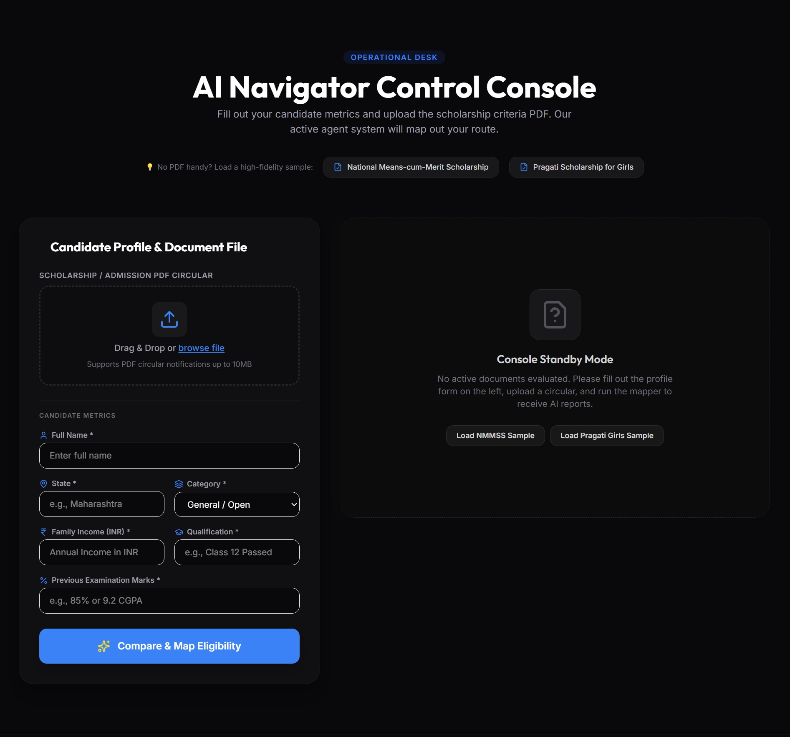
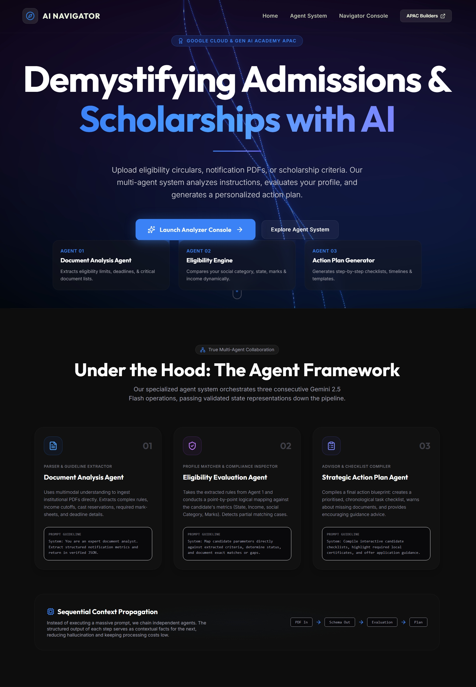
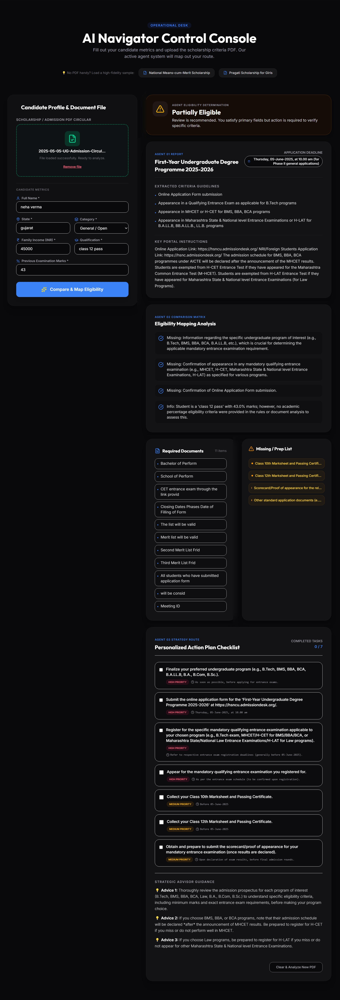
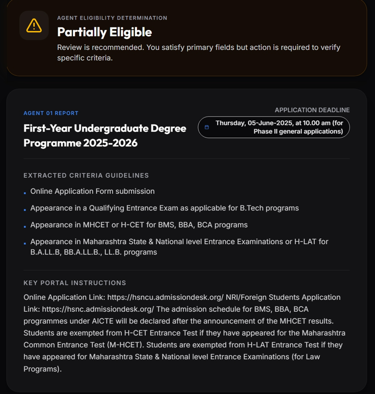
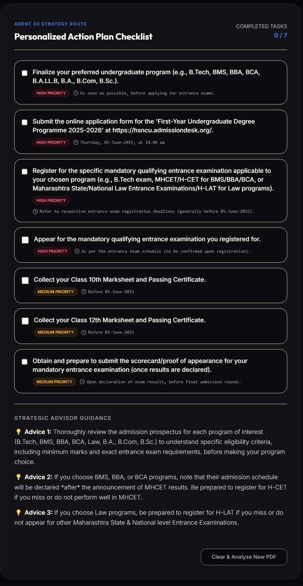

<div align="center">
  
  
  
  
  
  
  
</div>

<br>

<div align="center">
  <h1>🎓 AI Admission & Scholarship Navigator</h1>
  <p><strong>A Multi-Agent AI System for Demystifying Admissions and Scholarships</strong></p>
  <p>Built with Google ADK, Gemini 2.5 Flash, FastAPI, and React</p>
  <br>
  <a href="#-features">Features</a> •
  <a href="#-architecture">Architecture</a> •
  <a href="#-quick-start">Quick Start</a> •
  <a href="#-deployment">Deployment</a>
</div>

---

## 📖 Table of Contents

- [Overview](#-overview)
- [Problem Statement](#-problem-statement)
- [Features](#-features)
- [Architecture](#-architecture)
- [Tech Stack](#-tech-stack)
- [Screenshots](#-screenshots)
- [Quick Start](#-quick-start)
- [API Documentation](#-api-documentation)
- [Deployment](#-deployment)
- [Project Structure](#-project-structure)
- [Contributing](#-contributing)
- [License](#-license)
- [Acknowledgments](#-acknowledgments)
- [Made By](#-made-by)

---

## 🚀 Overview

**AI Admission & Scholarship Navigator** is a production-grade, multi-agent AI system that transforms lengthy, confusing admission notifications and scholarship PDFs into personalized, actionable plans.

### 🎯 The Problem

Students, especially first-generation applicants and those from rural areas, face significant challenges:

- 📄 **Complex Documents**: Admission notifications are lengthy and filled with legal/educational jargon
- 🎯 **Confusing Eligibility**: Criteria are buried in complex language and often misinterpreted
- ⏰ **Missed Deadlines**: Important dates are difficult to track
- 📋 **Document Confusion**: Students don't know which documents to gather
- 🏷️ **Category Confusion**: Special categories are often misunderstood as mandatory requirements

### 💡 The Solution

Our system uses **3 specialized AI agents** powered by Google ADK and Gemini 2.5 Flash to:

1. **Analyze Documents** - Extract key information from PDFs with smart classification
2. **Check Eligibility** - Compare student profiles against requirements fairly
3. **Generate Action Plans** - Create personalized checklists with deadlines and next steps

---

## ✨ Features

### 🤖 Multi-Agent AI System

| Agent | Function | Key Capabilities |
|-------|----------|------------------|
| **Document Analysis Agent** | PDF Processing & Classification | Extracts scholarship/admission details, distinguishes between mandatory and optional criteria |
| **Eligibility Agent** | Profile Comparison | Fair assessment that never rejects students for optional special categories |
| **Action Plan Agent** | Personalized Planning | Creates checklists with priorities, deadlines, missing documents, and timelines |

### 🎯 Smart Document Classification

- ✅ Distinguishes between **Scholarship** and **Admission** notifications
- ✅ Separates **Mandatory Requirements** from **Optional Special Categories**
- ✅ Identifies **Alternative Admission Paths** (MHCET, H-CET, H-LAT, etc.)
- ✅ Never treats special categories (Minority, In-house, Reserved) as mandatory

### 📋 Personalized Action Plans

- ✅ Immediate actions prioritized by urgency
- ✅ Checklist with priority levels (High/Medium/Low)
- ✅ Missing documents identification
- ✅ Strategic recommendations
- ✅ Week-by-week timeline
- ✅ Interactive checklist tracking

### 🎨 Beautiful User Interface

- ✅ Modern, Google-inspired design
- ✅ Responsive for mobile and desktop
- ✅ Real-time agent status updates
- ✅ Smooth animations with Framer Motion
- ✅ Drag-and-drop PDF upload

---

## 🏗️ Architecture

```
┌─────────────────────────────────────────────────────────────────┐
│ User Browser (Netlify Deployment)                               │
└─────────────────────────────────────────────────────────────────┘
                              │
                              ▼
┌─────────────────────────────────────────────────────────────────┐
│ React Frontend (Vite)                                           │
│ - Tailwind CSS for styling                                      │
│ - Framer Motion for animations                                  │
│ - Lucide React for icons                                        │
└─────────────────────────────────────────────────────────────────┘
                              │
                              ▼
┌─────────────────────────────────────────────────────────────────┐
│ FastAPI Backend (Render)                                        │
│ - RESTful API endpoints                                          │
│ - CORS configuration                                            │
│ - PDF processing with PyPDF2                                    │
│ - Error handling & logging                                      │
└─────────────────────────────────────────────────────────────────┘
                              │
                              ▼
┌─────────────────────────────────────────────────────────────────┐
│ Google ADK Multi-Agent System                                   │
│                                                                  │
│  ┌────────────────────────────────────────────────────────┐    │
│  │ Agent 1: Document Analysis Agent                       │    │
│  │ - Extracts scholarship/admission details               │    │
│  │ - Classifies document type                             │    │
│  │ - Separates mandatory vs optional criteria             │    │
│  │ - Identifies alternative admission paths               │    │
│  └────────────────────────────────────────────────────────┘    │
│                              │                                   │
│                              ▼                                   │
│  ┌────────────────────────────────────────────────────────┐    │
│  │ Agent 2: Eligibility Agent                             │    │
│  │ - Compares profile against requirements                │    │
│  │ - Never penalizes for optional categories              │    │
│  │ - Provides detailed reasoning                          │    │
│  │ - Calculates eligibility score                         │    │
│  └────────────────────────────────────────────────────────┘    │
│                              │                                   │
│                              ▼                                   │
│  ┌────────────────────────────────────────────────────────┐    │
│  │ Agent 3: Action Plan Agent                             │    │
│  │ - Creates personalized checklists                      │    │
│  │ - Identifies missing documents                         │    │
│  │ - Generates timeline & next steps                      │    │
│  │ - Provides strategic recommendations                   │    │
│  └────────────────────────────────────────────────────────┘    │
└─────────────────────────────────────────────────────────────────┘
                              │
                              ▼
┌─────────────────────────────────────────────────────────────────┐
│ Google Gemini 2.5 Flash (AI Model for all agents)               │
└─────────────────────────────────────────────────────────────────┘
```

---

## 🛠️ Tech Stack

### Backend

| Technology | Version | Purpose |
|------------|---------|---------|
| **Python** | 3.11+ | Core language |
| **FastAPI** | 0.115+ | Web framework |
| **Google ADK** | 0.1.0 | Agent framework |
| **Gemini 2.5 Flash** | Latest | AI model |
| **PyPDF2** | 3.0+ | PDF text extraction |
| **Uvicorn** | 0.24+ | ASGI server |

### Frontend

| Technology | Version | Purpose |
|------------|---------|---------|
| **React** | 18 | UI library |
| **Vite** | 5.0+ | Build tool |
| **Tailwind CSS** | 4.0+ | Styling |
| **Framer Motion** | 10.0+ | Animations |
| **Lucide React** | Latest | Icons |
| **TypeScript** | 5.0+ | Type safety |

### Deployment

| Service | Purpose |
|---------|---------|
| **Render** | Backend hosting (free tier) |
| **Netlify** | Frontend hosting (free tier) |

---

## 📸 Screenshots

### Dashboard - Standby Mode

*The main dashboard before analysis - ready for PDF upload*

### Dashboard - Agent Processing

*Real-time multi-agent collaboration with status updates*

### Dashboard - Results

*Complete analysis results with eligibility status, scholarship summary, and action plan*

### Eligibility Status Banner

*Clear visual indication of eligibility status (Eligible/Partially Eligible/Not Eligible)*

### Action Plan Checklist

*Interactive checklist with priorities, deadlines, and completion tracking*

### Mobile Responsive

*Fully responsive design that works on all devices*

---

## 🚀 Quick Start

### Prerequisites

- Python 3.11 or higher
- Node.js 18 or higher
- Google Gemini API Key ([Get it here](https://makersuite.google.com/app/apikey))

### Backend Setup

```bash
# Clone the repository
git clone https://github.com/YUG634/ai-admission-scholarship-navigator.git
cd ai-admission-scholarship-navigator

# Navigate to backend
cd backend

# Create virtual environment
python -m venv venv

# Activate virtual environment
# Windows:
venv\Scripts\activate
# Mac/Linux:
source venv/bin/activate

# Install dependencies
pip install -r requirements.txt

# Set up environment variables
cp .env.example .env
# Add your GEMINI_API_KEY to .env

# Run the server
python run.py
```

### Frontend Setup

```bash
# Navigate to frontend
cd frontend

# Install dependencies
npm install

# Run development server
npm run dev
```

### Access the Application

- **Frontend**: http://localhost:5173
- **Backend API**: http://localhost:8000
- **API Documentation**: http://localhost:8000/docs

---

## 📊 API Documentation

### Endpoints

| Method | Endpoint | Description |
|--------|----------|-------------|
| GET | `/` | Root endpoint with service info |
| GET | `/health` | Health check with component status |
| POST | `/api/v1/analyze` | Analyze PDF with student profile |

### Example Request

```bash
curl -X POST "http://localhost:8000/api/v1/analyze" \
  -F "pdf_file=@scholarship.pdf" \
  -F "full_name=John Doe" \
  -F "state=Maharashtra" \
  -F "category=General" \
  -F "family_income=500000" \
  -F "current_qualification=B.Sc" \
  -F "marks_percentage=85"
```

### Example Response

```json
{
  "analysis": {
    "document_type": "admission",
    "scholarship_name": "First-Year Undergraduate Degree Programme 2025-2026",
    "deadline": "Thursday, 05-June-2025",
    "mandatory_requirements": [
      "12th pass or equivalent",
      "Entrance exam required"
    ],
    "special_categories": [
      "Sindhi Minority students",
      "In-house students"
    ],
    "alternative_admission_paths": [
      "MHCET scores",
      "H-CET exam"
    ]
  },
  "eligibility": {
    "status": "Partially Eligible",
    "score": 65,
    "reasons": [
      "Meets academic requirements",
      "Entrance exam information missing"
    ]
  },
  "action_plan": {
    "immediate_actions": [
      "Register for entrance exam",
      "Gather required documents"
    ],
    "checklist": [],
    "missing_documents": [],
    "timeline": {}
  }
}
```

---

## 🚢 Deployment

### Deploy Backend to Render

1. Create account at [Render](https://render.com)
2. Click "New +" → "Web Service"
3. Connect your GitHub repository
4. Use these settings:
   - **Build Command**: `pip install -r requirements.txt`
   - **Start Command**: `uvicorn app.main:app --host 0.0.0.0 --port $PORT`
   - **Environment Variables**: Add `GEMINI_API_KEY` and `ALLOWED_ORIGINS`
5. Click "Create Web Service"

### Deploy Frontend to Netlify

1. Create account at [Netlify](https://netlify.com)
2. Click "Add new site" → "Import an existing project"
3. Connect your GitHub repository
4. Build settings (auto-detected):
   - **Build Command**: `npm run build`
   - **Publish Directory**: `dist`
   - **Environment Variables**: Add `VITE_API_BASE_URL`
5. Click "Deploy site"

---

## 📁 Project Structure

```
ai-admission-scholarship-navigator/
├── backend/
│   ├── app/
│   │   ├── agents/
│   │   │   ├── __init__.py
│   │   │   ├── adk_document_agent.py
│   │   │   ├── adk_eligibility_agent.py
│   │   │   └── adk_action_agent.py
│   │   ├── api/
│   │   │   ├── __init__.py
│   │   │   └── routes.py
│   │   ├── models/
│   │   │   ├── __init__.py
│   │   │   └── schemas.py
│   │   ├── orchestrator/
│   │   │   ├── __init__.py
│   │   │   └── adk_orchestrator.py
│   │   ├── services/
│   │   │   ├── __init__.py
│   │   │   └── gemini_service.py
│   │   ├── utils/
│   │   │   ├── __init__.py
│   │   │   ├── logger.py
│   │   │   ├── errors.py
│   │   │   └── pdf_processor.py
│   │   └── main.py
│   ├── tests/
│   │   ├── __init__.py
│   │   ├── test_api.py
│   │   └── test_agents.py
│   ├── requirements.txt
│   ├── Dockerfile
│   ├── .env.example
│   └── README.md
├── frontend/
│   ├── src/
│   │   ├── components/
│   │   │   ├── Dashboard.tsx
│   │   │   └── Hero.tsx
│   │   ├── services/
│   │   │   └── api.ts
│   │   ├── types/
│   │   │   └── index.ts
│   │   ├── App.tsx
│   │   └── main.tsx
│   ├── package.json
│   ├── vite.config.ts
│   ├── tailwind.config.js
│   ├── netlify.toml
│   └── Dockerfile
├── .github/
│   └── workflows/
│       ├── deploy-backend.yml
│       └── deploy-frontend.yml
├── screenshots/
│   ├── dashboard-standby.png
│   ├── agent-processing.png
│   ├── results-view.png
│   ├── eligibility-status.png
│   ├── action-plan.png
│   └── mobile-view.png
├── .gitignore
├── LICENSE
└── README.md
```

---

## 🤝 Contributing

We welcome contributions! Please follow these steps:

1. Fork the repository
2. Create a feature branch (`git checkout -b feature/AmazingFeature`)
3. Commit your changes (`git commit -m 'Add some AmazingFeature'`)
4. Push to the branch (`git push origin feature/AmazingFeature`)
5. Open a Pull Request

### Development Guidelines

- Follow PEP 8 for Python code
- Use ESLint and Prettier for frontend code
- Write tests for new features
- Update documentation for API changes
- Keep code modular and well-commented

---

## 📝 License

This project is licensed under the MIT License - see the [LICENSE](LICENSE) file for details.

---

## 🙏 Acknowledgments

- **Google ADK** - For providing the agent framework
- **Google Gemini** - For the powerful AI capabilities
- **FastAPI** - For the excellent web framework
- **React** - For the beautiful frontend library
- **Tailwind CSS** - For the amazing styling framework
- **Google Cloud & Gen AI Academy** - For the "Meet the Builders" initiative

---

## 👨‍💻 Made By

<div align="center">
  <h3>
    <a href="https://github.com/YUG634">
      
    </a>
    <a href="https://linkedin.com/in/yug-agrawal-101bb11a0">
      
    </a>
    <a href="mailto:yugagrawalmng@gmail.com">
      
    </a>
  </h3>

  **Yug Agrawal**

  🚀 Building AI-powered solutions for real-world problems

  
  
  
  
</div>

<div align="center">
  <p>Built with ❤️ for the Google Cloud & Gen AI Academy "Meet the Builders" initiative</p>
  <p>
    
    
  </p>
</div>
